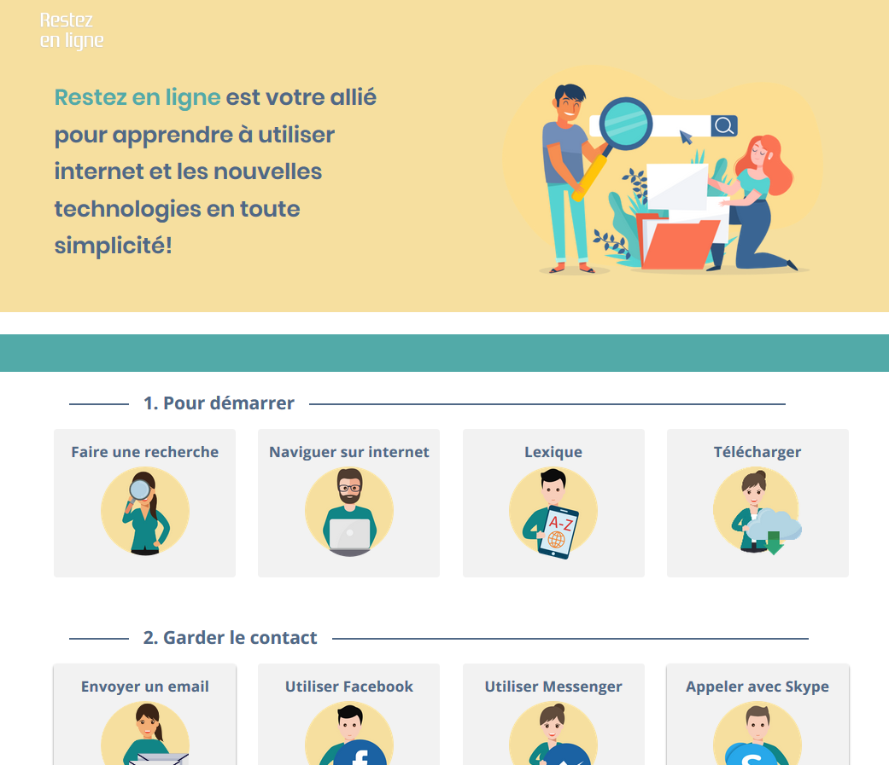

Nous avons participé au hackathon "Stay the F*** at Home" organisé du 3 au 5 avril 2020.
Il était organisé par le Microsoft Center Belgique.

Nous avons travaillé sur la problématique de la solitude engendrée par le confinement du au coronavirus.

Beaucoup trop de gens en Belgique ont un ordinateur, mais ne savent pas bien s'en servir.
Quand ils ont besoin d'aide pour se connecter à Skype ou gérer leur compte en ligne, ils demandent alors de l'aide à un proche.
Cependant, en situation de confinement, ce proche n'est plus disponible et ils doivent se débrouiller seuls.
Ils cherchent un peu, mais ne trouvent pas toujours. Au sentiment de solitude s'ajoute alors celui d'un décalage avec la société et un mal-être permanent peut s'installer. 
L'objectif de notre projet était d'aider ces personnes et leur proposer des tutoriels simples et visuels pour qu'ils se forment eux-mêmes. 

Nous étions une équipe de 5: 
- 1 web-designer, C. Larmuseau
- 1 chargée de communication/rédaction des textes, E. Lambert
- 2 front-ends: H. Al-obaidi et B. Mayeur (moi)
- 1 back-end: A. Englebert

Technologies utilisées: Vue.JS + CSS

J'étais en charge de l'intégration de la maquette du site. J'ai également contribué à la réflexion sur le choix de la problématique et de la meilleure manière de l'aborder.

La jonction front-end/back-end nous prenait trop de temps pour une question de mise en ligne de la DB, nous avons donc décidé de mettre toutes les données du back-end en front-end.